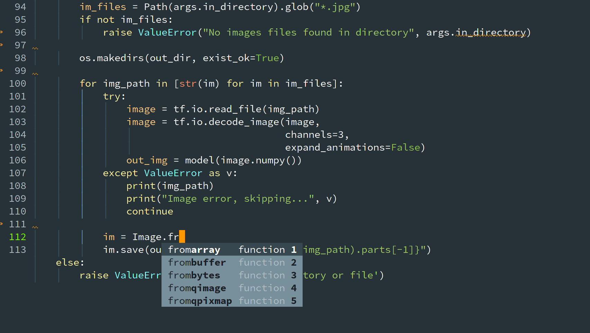

# Emacs Configuration
My Emacs configuration. The file `init.el` should be added to the `.emacs.d` directory.

The following screenshot shows the editing of a python file

## Packages

The followings packages are needed and automatically installed form ELPA if absent:
*    better-defaults
*    material-theme
*    projectile
*    magit
*    neotree
*    ivy
*    counsel
*    swiper
*    powerline
*    rust-mode
*    lsp-ui
*    flycheck-rust
*    elpy
*    company-lsp
*    blacken
*    yaml-mode
*    highlight-indent-guides
*    auctex

## Features

### Language support
`company` auto-completion and `flycheck` are enabled.

For python, `elpy` is loaded and `flake8` and `pyright` are enabled with `flycheck`.

Rust support is configured with LSP.

### IDE

Project management is enabled with `projectile` (prefix key is <kbd>C-c p</kbd>)

`magit` can be launched with <kbd>C-x g</kbd> for any git manipulations.
