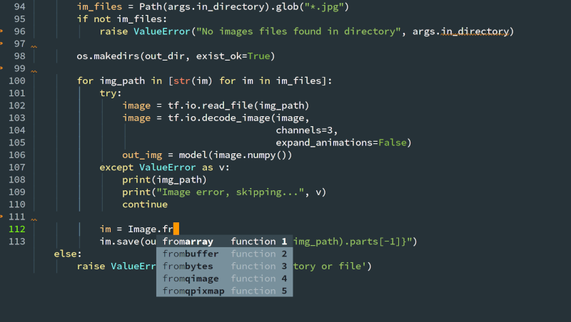

# Emacs Configuration
My Emacs configuration. The file `init.el` should be added to the `.emacs.d` directory.

The following screenshot shows the editing of a python file

## Packages

The followings packages are needed and automatically installed form ELPA if absent:
* better-defaults 
* material-theme
* magit
* neotree
* rustic
* blacken
* yaml-mode
* highlight-indent-guides
* auctex
* yasnippet
* yasnippet-snippets
* markdown-mode
* use-package
* numpydoc
* py-isort
* consult
* eldoc-box
* orderless
* corfu
* nerd-icons-corfu

## Features

### Language support

For python, `eglot` is loaded with `pyright`.

### IDE

Project management is enabled with standard `project.el` (prefix key is <kbd>C-x p</kbd>)

`magit` can be launched with <kbd>C-x g</kbd> for any git manipulations.
